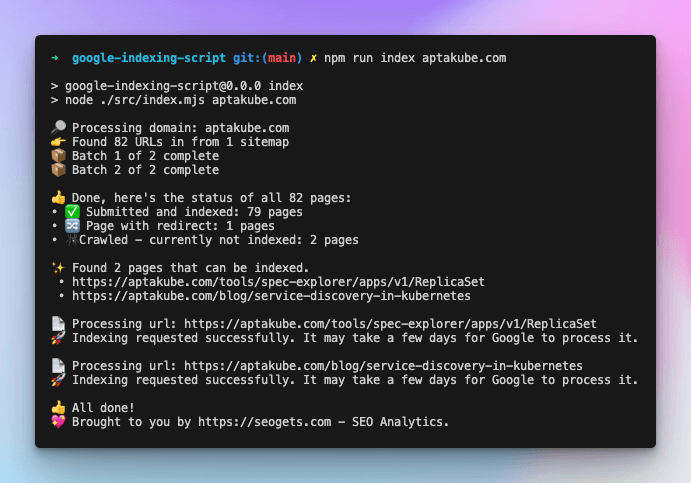

# Google Indexing Script

Use this script to get your entire site indexed on Google in less than 48 hours. No tricks, no hacks, just a simple script and a Google API.

You can read more about the motivation behind it and how it works in this blog post https://seogets.com/blog/google-indexing-script

> [!IMPORTANT]  
> 1. Indexing != Ranking. This will not help your content/page rank on Google, it'll just let Google know about the existence of all your pages.
> 2. This script uses [Google Indexing API](https://developers.google.com/search/apis/indexing-api/v3/quickstart). While there is no absolute guarantee that every page will be indexed, recent tests conducted in December 2023 have shown a notably high success rate.

## Requirements

- Install [Node.js](https://nodejs.org/en/download)
- An account on [Google Search Console](https://search.google.com/search-console/about) with the verified sites you want to index
- An account on [Google Cloud](https://console.cloud.google.com/)

## Preparation

1. Download or clone this repository
2. Follow this [guide](https://developers.google.com/search/apis/indexing-api/v3/prereqs) from Google. By the end of it, you should have a project on Google Cloud with the Indexing API enabled, a service account with the `Owner` permission on your sites.
3. Make sure you enable both `Google Search Console API` and `Web Search Indexing API` on your [Google Project ➤ API Services ➤ Enabled API & Services](https://console.cloud.google.com/apis/dashboard).
4. [Download the JSON](https://github.com/goenning/google-indexing-script/issues/2) file with the credentials of your service account and save it in the same folder as the script. The file should be named `service_account.json`

## Usage

1. Open a terminal and navigate to the folder where you cloned the repository
2. Ensure you are using an up-to-date Node.js version, with a preference for v20 or later. Check your current version with `node -v`.
3. Run `npm install` to install the dependencies
4. Run `npm run index <domain or url>` to index all the pages of your site.
- If your site is a `Domain` Property on GSC, then run it like `npm run index seogets.com`
- Otherwise, if it's a `URL Prefix` property, then run it like `npm run index https://seogets.com`
- When in doubt try both 😀

Here's an example of what you should expect:

**Important Notes:**

- Your site must have 1 or more sitemaps submitted to Google Search Console. Otherwise, the script will not be able to find the pages to index.
- You can run the script as many times as you want. It will only index the pages that are not already indexed.
- Sites with a large number of pages might take a while to index, be patient.

## 📄 License

MIT License

## 💖 Sponsor

This project is sponsored by [SEO Gets](https://seogets.com)

